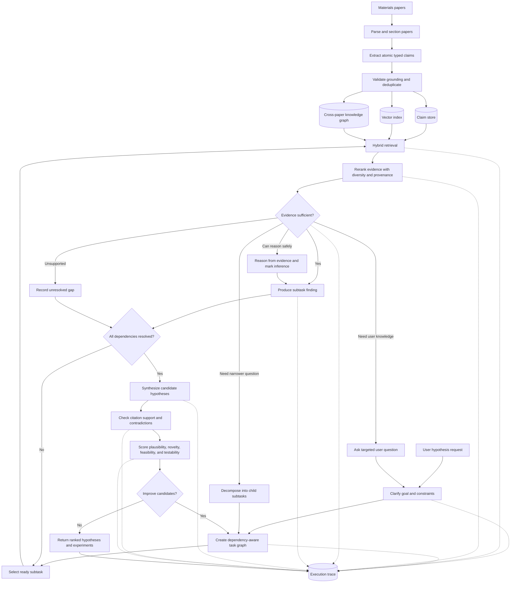

# materials-hypothesis-generation

A materials-science hypothesis generation pipeline that extracts argumentative roles from research papers, builds a cross-paper knowledge graph, retrieves non-linear inspirations, generates branching hypothesis candidates, and ranks them with multiple critics.

## Pipeline

1. Convert scientific PDFs to column-aware text with `pdf_convert.py`.
2. Extract and reconcile typed research roles with `run_extraction.py`.
3. Normalize each paper into typed entities and evidence-backed relations with
  `build_evidence_graph.py`.
4. Backfill full source passages, citation mentions, and table contexts with
  `source_context.py`.
5. Build a cross-paper claim graph with `graph_build.py`.
6. Retrieve, compose, refine, merge, and critique hypotheses with `adaptive_agent.py` or
  the simpler `hypothesis_agent.py` baseline.
7. Evaluate extraction and generation with abstract comparison, audits, and masked-paper recovery.

## Adaptive Agent Workflow

The target system scales the extraction stage to a broad materials-science corpus and
treats each **atomic extracted claim** as an independently retrievable entity. An entity is
not an arbitrary text fragment: it stores a stable ID, argumentative role, normalized claim,
verbatim evidence, source paper and section, extraction confidence, and links to related
entities. This preserves enough context to retrieve individual ideas without losing their
provenance.



### Easy overview

1. The user describes the kind of hypothesis they want.
2. The decomposer turns that request into connected literature questions, such as relevant
  mechanisms, possible interventions, constraints, and conflicting evidence.
3. The retriever finds claim entities for each question and follows cross-paper graph,
  citation, and comparison relations when available.
4. The sufficiency assessor decides whether to accept the evidence, reason with a stated
  caveat, search a narrower question, ask the user for a missing constraint, or leave the
  question unresolved.
5. The synthesizer combines the resolved findings into cited hypotheses. Critics score each
  candidate, and the complete task, retrieval, decision, conflict, and citation history is
  saved for the user.

### Agent responsibilities

The current implementation keeps these as separate logical agents in one process, which
makes their inputs and outputs auditable without requiring a different model deployment for
every role.

| Agent | Responsibility |
| --- | --- |
| Orchestrator | Select ready tasks, enforce dependencies, and write the execution trace |
| Decomposer | Create structured retrieval questions and narrower child questions |
| Retriever | Combine lexical and role matching with graph and typed-relation expansion |
| Sufficiency assessor | Route evidence to accept, caveat, decompose, ask-user, or unresolved |
| Evidence adjudicator | Classify contradictions while preserving both claims and conditions |
| Hypothesis synthesizer | Produce cited mechanisms, predictions, boundary conditions, and falsifiers |
| Critics | Score plausibility, novelty, and feasibility |

### Agent stages

1. **Ingest and index:** continuously process papers into grounded claim entities. Use
  vector retrieval for semantic similarity, lexical retrieval for exact materials and
  formulas, and graph traversal for mechanisms, contradictions, constraints, and
  cross-domain analogies.
2. **Clarify the request:** convert the user's desired hypothesis into an explicit target
  material or class, desired property, operating conditions, constraints, novelty scope,
  and acceptable validation methods. Ask only for missing constraints that would change
  the search.
3. **Build a task graph:** decompose the goal into related tasks with explicit dependencies,
  such as target-property mechanisms, candidate interventions, known failure modes,
  synthesis constraints, characterization methods, and falsifying experiments. This must
  be a directed task graph rather than an unrelated list of questions.
4. **Solve each subtask adaptively:** retrieve and rerank evidence, then make a structured
  decision: `sufficient`, `reason_with_caveat`, `decompose_further`, `ask_user`, or
  `unresolved`. Inference generated by the model must be labeled separately from retrieved
  literature claims.
5. **Synthesize hypotheses:** combine only compatible subtask findings into multiple
  mechanism-specific candidates. Every claim in a candidate must point to supporting or
  contradicting entity IDs, while genuinely new links are labeled as proposed inferences.
6. **Critique and revise:** score candidates for physical plausibility, novelty, feasibility,
  testability, evidence coverage, and contradiction risk. Weak candidates can trigger a
  new retrieval or decomposition cycle rather than merely receiving a lower score.
7. **Return an auditable result:** show the ranked hypothesis, mechanism, predicted outcome,
  boundary conditions, falsifying experiment, uncertainties, evidence citations, rejected
  alternatives, unresolved gaps, task graph, retrieval decisions, and revision lineage.

`adaptive_agent.py` now implements dependency-aware decomposition, claim retrieval with graph
expansion, sufficiency routing, one-level recursive gap decomposition, user-question recording,
conflict adjudication, cited synthesis, criticism, and a complete JSON execution trace. The
existing `hypothesis_agent.py` remains the simpler direct retrieval and beam-search baseline.

`evidence_model.py` validates typed relations such as `cites`, `supports`, `contradicts`,
`compares_with`, `outperforms`, and `underperforms`. Each relation records the linked entity
IDs, source paper and element, verbatim evidence, metric, values, units, conditions, and
confidence. The retriever follows these links and records the exact relation in
`retrieval_reason`. Current seed retrieval is lexical plus role-aware; a semantic vector index
remains future work.

### Typed evidence model

The evidence graph uses ten entity types: `Paper`, `Atomic claim`, `Method`,
`Material/system`, `Property`, `Experimental condition`, `Measurement`, `Dataset`,
`Figure/table`, and `Hypothesis`. It uses eleven relation types: `CITES`, `SUPPORTS`,
`CONTRADICTS`, `USES_METHOD`, `COMPARES_WITH`, `OUTPERFORMS`, `UNDERPERFORMS`,
`APPLIES_UNDER`, `MEASURES`, `DERIVED_FROM`, and `ANALOGOUS_TO`.

Role extraction and semantic normalization are separate checkpoints. This is intentional:
normalization starts as soon as one paper's extraction succeeds, but a normalization failure
does not rerun extraction or discard the paper's claims. Each paper gets an atomic bundle under
`evidence_graph/papers/`; only validated bundles are merged into `entities.jsonl` and
`relations.jsonl`.

The checked-in deterministic build covers all 67 papers and contains 11,481 unique entities
and 14,453 relations, including 4,271 atomic claims and 857 `CITES` edges. External papers are
canonicalized by DOI or arXiv ID while each citing paper retains its own evidence-backed edge.
See `evidence_graph/summary.json` for complete type counts.

Deterministic normalization is the robust corpus-scale baseline and requires no model call.
Use `--normalizer llm` for richer semantic enrichment. The deterministic comparison detector
is intentionally conservative about `OUTPERFORMS` and `UNDERPERFORMS`, but `COMPARES_WITH`
remains lexical and can include general contrastive prose; inspect its evidence span before
treating it as a quantitative benchmark.

The checked-in source-context backfill augments graph-selected claims with their original
passages, inline citation mentions, parsed bibliography entries, and raw table contexts. Graph
edges guide context assembly; they are not used as substitutes for source text. PDF-to-text
conversion does not reliably preserve merged cells or column geometry, so table records retain
raw text and an extraction confidence rather than inventing structured rows. External cited-paper
content is marked `requires_resolution` until full text or an abstract is fetched.

See [`examples/relations.example.jsonl`](examples/relations.example.jsonl) for citation and
condition-aware comparison records. `OUTPERFORMS` and `UNDERPERFORMS` are never stored as bare
edges: they carry the metric, compared values, unit, operating conditions, source table or
figure, evidence span, and extraction confidence.

## Setup

```bash
python3 -m venv .venv
.venv/bin/pip install -r requirements.txt
```

The pipeline defaults to dry-run mode. Set `MATHG_PROVIDER=trapi` for Microsoft TRAPI, or configure an OpenAI-compatible endpoint with `OPENAI_API_KEY`, `OPENAI_BASE_URL`, and `OPENAI_MODEL`.

## Usage

Convert a paper:

```bash
.venv/bin/python pdf_convert.py paper.pdf texts/paper.txt
```

Extract research roles:

```bash
MATHG_PROVIDER=trapi .venv/bin/python run_extraction.py \
  --input_dir texts --out_dir outputs --max_passes 0 --retry_delay 120
```

Extract and immediately build typed evidence for each completed paper:

```bash
MATHG_PROVIDER=trapi .venv/bin/python run_extraction.py \
  --input_dir texts --out_dir outputs --max_passes 0 --retry_delay 120 \
  --evidence_graph_dir evidence_graph --metadata results/new_candidates.json
```

For an already extracted corpus, run only the new stage:

```bash
MATHG_PROVIDER=trapi .venv/bin/python build_evidence_graph.py \
  --outputs-dir outputs_bulk --graph-dir evidence_graph \
  --source-dir texts_bulk --metadata results/new_candidates.json \
  --normalizer deterministic --max-passes 0 --retry-delay 120
```

Backfill source context without rerunning extraction:

```bash
.venv/bin/python source_context.py \
  --source-dir texts_bulk --outputs-dir outputs_bulk \
  --context-dir source_context
```

Generate and branch hypotheses:

```bash
MATHG_PROVIDER=trapi .venv/bin/python hypothesis_agent.py \
  "your materials research goal" outputs_bulk registry.json \
  --search --rounds 2 --beam 2
```

Run the adaptive, traceable workflow:

```bash
MATHG_PROVIDER=trapi .venv/bin/python adaptive_agent.py \
  "Improve stability of lithium-metal solid-electrolyte interfaces" \
  outputs_bulk results/adaptive_run.json --max-depth 1 \
  --entities evidence_graph/entities.jsonl \
  --relations evidence_graph/relations.jsonl \
  --source-context source_context
```

The output JSON contains the task graph, evidence returned for each task, sufficiency
decisions, child questions, unresolved gaps, conflict assessments, ranked candidates, critic
results, and cited entity IDs.

Run masked-paper recovery:

```bash
MATHG_PROVIDER=trapi .venv/bin/python validate_masked.py outputs_bulk PAPER_ID
```

## Gold vs. Extracted Results

We evaluated hypothesis-related content extracted from seven papers against each paper's
author-written abstract. An LLM judge scored agreement on a 1-5 scale.

| Metric | Mean score |
| --- | ---: |
| Concept overlap | 4.86/5 |
| Property overlap | 4.57/5 |
| Keyword matching | 5.00/5 |
| Overall (all 21 ratings) | 4.81/5 |

Four of seven papers received a perfect 15/15. All seven received 5/5 for keyword
matching; the lowest individual dimension score was 4/5.

### Evaluation procedure

1. Seven open-access arXiv PDFs were converted to text with the column-aware PyMuPDF
  converter in `pdf_convert.py`.
2. `run_extraction.py` split each full paper into detected sections and sent every section
  through the 11-role prompt in [`prompts/extraction.md`](prompts/extraction.md). The same
  model then reconciled near-duplicate items for each role across the paper. The evaluated
  records are in [`outputs_v2/`](outputs_v2/).
3. `compare_with_gold.py` constructed the extracted side from up to eight reconciled items
  from each of `hypothesis_statement`, `causal_claim`, and `mechanism_principle`, falling
  back to raw items when a role had no reconciled output. This is a collection of
  hypothesis-related claims, not one separately generated hypothesis.
4. The gold side was the paper's author-written abstract stored in
  [`results/gold_abstracts.json`](results/gold_abstracts.json). The judge received the gold
  abstract and extracted claim collection together, then independently returned
  `concept_overlap`, `property_overlap`, and `keyword_matching` scores from 1 to 5 plus a
  one-sentence justification. The exact judge template is in
  [`prompts/gold-comparison-judge.md`](prompts/gold-comparison-judge.md).
5. Extraction, reconciliation, and judging all used `GPT 5.4`, with JSON-constrained responses.
  Extraction allowed up to 8,000 completion tokens per call; judging allowed 600. Failed
  judge calls were retried up to five times with exponential backoff.

Reproduce the comparison with:

```bash
MATHG_PROVIDER=trapi .venv/bin/python compare_with_gold.py \
  results/gold_abstracts.json outputs_v2
```

Per-paper scores and judge justifications are in
[`results/gold_comparison_v2.json`](results/gold_comparison_v2.json).

### Interpretation and limitations

These scores indicate strong agreement with abstract-level concepts, properties, and
entities on this small benchmark, but they are a sanity check rather than an independent
ground-truth evaluation. The full-text inputs used for extraction included each paper's
Abstract section, so this was **not a blinded abstract-recovery test** and lexical overlap
may be inflated. The same LLM deployment performed extraction and judging, which adds
self-evaluation bias. The abstract is only a proxy for a gold hypothesis, the sample has
seven papers, and no human or independently trained judge calibrated the scores. A stronger
evaluation should remove abstracts from extractor input, use an independent judge or human
raters, and report agreement over a larger held-out corpus.

## Prompts

All extraction, reconciliation, generation, critique, refinement, merge, and evaluation
judge prompts are documented in [`prompts/`](prompts/README.md), including the complete
11-role extraction taxonomy and runtime user-message templates.

## Included Results

- `outputs_bulk/`: role extractions for 67 open-access materials-science papers.
- `outputs_real/`, `outputs_v2/`, and `outputs/`: earlier extraction experiments.
- `results/`: evaluation reports, hypothesis registries, candidate searches, run logs, and corpus metadata.
- `gold_comparison.json`: abstract-based extraction comparison generated by the pipeline.

Downloaded PDFs, extracted full paper text, credentials, virtual environments, and caches are intentionally excluded. Corpus identifiers and discovery metadata are included so source papers can be retrieved independently.

### Argumentative Roles

The pipeline extracts **11 argumentative roles** from scientific papers:

1. **`problem_motivation`**: The gap or need addressed by the paper.
2. **`prior_approach`**: An existing method or approach cited as prior work.
3. **`prior_limitation`**: A stated weakness or limitation of a prior approach.
4. **`rejected_alternative`**: An approach considered but not used, including contrastive choices such as “rather than X, we...”, along with the reason.
5. **`inspiration_source`**: An analogy, prior finding, or borrowed method that influenced the new approach.
6. **`causal_claim`**: A claim that one factor caused, increased, or decreased another, including conditions or magnitude when stated.
7. **`mechanism_principle`**: The physical or chemical reasoning underlying a causal claim.
8. **`hypothesis_statement`**: An explicit or implicit statement of the paper's central proposal or expectation.
9. **`evidence_result`**: A measured result that supports or refutes a claim.
10. **`constraint`**: A limitation or boundary condition that the solution must satisfy.
11. **`contradiction`**: A finding that conflicts with a prior claim in the literature.

These roles are defined in [`roles.py`](roles.py). Each extracted item also contains:

* **Concise paraphrase** of the extracted information.
* **Verbatim evidence span** from the source text supporting the extraction.

