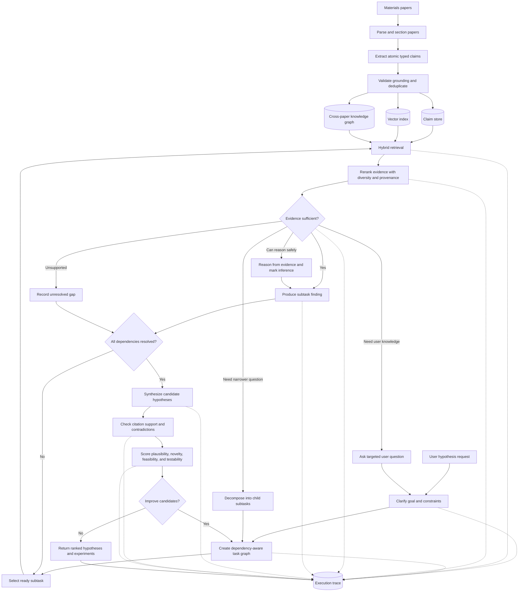

# materials-hypothesis-generation

A materials-science hypothesis generation pipeline that extracts argumentative roles from research papers, builds a cross-paper knowledge graph, retrieves non-linear inspirations, generates branching hypothesis candidates, and ranks them with multiple critics.

## Pipeline

1. Convert scientific PDFs to column-aware text with `pdf_convert.py`.
2. Extract and reconcile typed research roles with `run_extraction.py`.
3. Build a cross-paper lexical knowledge graph with `graph_build.py`.
4. Retrieve, compose, refine, merge, and critique hypotheses with `hypothesis_agent.py`.
5. Evaluate extraction and generation with abstract comparison, audits, and masked-paper recovery.

## Proposed Agent Pipeline

The long-term system scales the extraction stage to a broad materials-science corpus and
treats each **atomic extracted claim** as an independently retrievable entity. An entity is
not an arbitrary text fragment: it stores a stable ID, argumentative role, normalized claim,
verbatim evidence, source paper and section, extraction confidence, and links to related
entities. This preserves enough context to retrieve individual ideas without losing their
provenance.



### Agent stages

1. **Ingest and index:** continuously process papers into grounded claim entities. Use
  vector retrieval for semantic similarity, lexical retrieval for exact materials and
  formulas, and graph traversal for mechanisms, contradictions, constraints, and
  cross-domain analogies.
2. **Clarify the request:** convert the user's desired hypothesis into an explicit target
  material or class, desired property, operating conditions, constraints, novelty scope,
  and acceptable validation methods. Ask only for missing constraints that would change
  the search.
3. **Build a task graph:** decompose the goal into related tasks with explicit dependencies,
  such as target-property mechanisms, candidate interventions, known failure modes,
  synthesis constraints, characterization methods, and falsifying experiments. This must
  be a directed task graph rather than an unrelated list of questions.
4. **Solve each subtask adaptively:** retrieve and rerank evidence, then make a structured
  decision: `sufficient`, `reason_with_caveat`, `decompose_further`, `ask_user`, or
  `unresolved`. Inference generated by the model must be labeled separately from retrieved
  literature claims.
5. **Synthesize hypotheses:** combine only compatible subtask findings into multiple
  mechanism-specific candidates. Every claim in a candidate must point to supporting or
  contradicting entity IDs, while genuinely new links are labeled as proposed inferences.
6. **Critique and revise:** score candidates for physical plausibility, novelty, feasibility,
  testability, evidence coverage, and contradiction risk. Weak candidates can trigger a
  new retrieval or decomposition cycle rather than merely receiving a lower score.
7. **Return an auditable result:** show the ranked hypothesis, mechanism, predicted outcome,
  boundary conditions, falsifying experiment, uncertainties, evidence citations, rejected
  alternatives, unresolved gaps, task graph, retrieval decisions, and revision lineage.

The current implementation is a prototype of stages 1, 5, 6, and 7: it creates typed claim
nodes, retrieves cross-paper neighbors, generates and branches candidates, applies three
critics, and records cited nodes and parent IDs. Goal clarification, recursive task planning,
sufficiency routing, user questions, hybrid retrieval, and a complete execution trace remain
to be implemented.

## Setup

```bash
python3 -m venv .venv
.venv/bin/pip install -r requirements.txt
```

The pipeline defaults to dry-run mode. Set `MATHG_PROVIDER=trapi` for Microsoft TRAPI, or configure an OpenAI-compatible endpoint with `OPENAI_API_KEY`, `OPENAI_BASE_URL`, and `OPENAI_MODEL`.

## Usage

Convert a paper:

```bash
.venv/bin/python pdf_convert.py paper.pdf texts/paper.txt
```

Extract research roles:

```bash
MATHG_PROVIDER=trapi .venv/bin/python run_extraction.py \
  --input_dir texts --out_dir outputs --max_passes 0 --retry_delay 120
```

Generate and branch hypotheses:

```bash
MATHG_PROVIDER=trapi .venv/bin/python hypothesis_agent.py \
  "your materials research goal" outputs_bulk registry.json \
  --search --rounds 2 --beam 2
```

Run masked-paper recovery:

```bash
MATHG_PROVIDER=trapi .venv/bin/python validate_masked.py outputs_bulk PAPER_ID
```

## Gold vs. Extracted Results

We evaluated hypothesis-related content extracted from seven papers against each paper's
author-written abstract. An LLM judge scored agreement on a 1-5 scale.

| Metric | Mean score |
| --- | ---: |
| Concept overlap | 4.86/5 |
| Property overlap | 4.57/5 |
| Keyword matching | 5.00/5 |
| Overall (all 21 ratings) | 4.81/5 |

Four of seven papers received a perfect 15/15. All seven received 5/5 for keyword
matching; the lowest individual dimension score was 4/5.

### Evaluation procedure

1. Seven open-access arXiv PDFs were converted to text with the column-aware PyMuPDF
  converter in `pdf_convert.py`.
2. `run_extraction.py` split each full paper into detected sections and sent every section
  through the 11-role prompt in [`prompts/extraction.md`](prompts/extraction.md). The same
  model then reconciled near-duplicate items for each role across the paper. The evaluated
  records are in [`outputs_v2/`](outputs_v2/).
3. `compare_with_gold.py` constructed the extracted side from up to eight reconciled items
  from each of `hypothesis_statement`, `causal_claim`, and `mechanism_principle`, falling
  back to raw items when a role had no reconciled output. This is a collection of
  hypothesis-related claims, not one separately generated hypothesis.
4. The gold side was the paper's author-written abstract stored in
  [`results/gold_abstracts.json`](results/gold_abstracts.json). The judge received the gold
  abstract and extracted claim collection together, then independently returned
  `concept_overlap`, `property_overlap`, and `keyword_matching` scores from 1 to 5 plus a
  one-sentence justification. The exact judge template is in
  [`prompts/gold-comparison-judge.md`](prompts/gold-comparison-judge.md).
5. Extraction, reconciliation, and judging all used Microsoft TRAPI deployment
  `gpt-5.4_2026-03-05`, API version `2025-04-01-preview`, with JSON-constrained responses.
  Extraction allowed up to 8,000 completion tokens per call; judging allowed 600. Failed
  judge calls were retried up to five times with exponential backoff.

Reproduce the comparison with:

```bash
MATHG_PROVIDER=trapi .venv/bin/python compare_with_gold.py \
  results/gold_abstracts.json outputs_v2
```

Per-paper scores and judge justifications are in
[`results/gold_comparison_v2.json`](results/gold_comparison_v2.json).

### Interpretation and limitations

These scores indicate strong agreement with abstract-level concepts, properties, and
entities on this small benchmark, but they are a sanity check rather than an independent
ground-truth evaluation. The full-text inputs used for extraction included each paper's
Abstract section, so this was **not a blinded abstract-recovery test** and lexical overlap
may be inflated. The same LLM deployment performed extraction and judging, which adds
self-evaluation bias. The abstract is only a proxy for a gold hypothesis, the sample has
seven papers, and no human or independently trained judge calibrated the scores. A stronger
evaluation should remove abstracts from extractor input, use an independent judge or human
raters, and report agreement over a larger held-out corpus.

## Prompts

All extraction, reconciliation, generation, critique, refinement, merge, and evaluation
judge prompts are documented in [`prompts/`](prompts/README.md), including the complete
11-role extraction taxonomy and runtime user-message templates.

## Included Results

- `outputs_bulk/`: role extractions for 67 open-access materials-science papers.
- `outputs_real/`, `outputs_v2/`, and `outputs/`: earlier extraction experiments.
- `results/`: evaluation reports, hypothesis registries, candidate searches, run logs, and corpus metadata.
- `gold_comparison.json`: abstract-based extraction comparison generated by the pipeline.

Downloaded PDFs, extracted full paper text, credentials, virtual environments, and caches are intentionally excluded. Corpus identifiers and discovery metadata are included so source papers can be retrieved independently.

## The pipeline extracts 11 argumentative roles:

 1.⁠ ⁠*⁠ problem_motivation ⁠*: The gap or need addressed by the paper.
 2.⁠ ⁠*⁠ prior_approach ⁠*: An existing method or approach cited as prior work.
 3.⁠ ⁠*⁠ prior_limitation ⁠*: A stated weakness of a prior approach.
 4.⁠ ⁠*⁠ rejected_alternative ⁠*: An approach considered but not used, including contrastive choices such as “rather than X, we...”, plus the reason.
 5.⁠ ⁠*⁠ inspiration_source ⁠*: An analogy, prior finding, or borrowed method that shaped the new approach.
 6.⁠ ⁠*⁠ causal_claim ⁠*: A claim that one factor caused, increased, or decreased another, including conditions or magnitude when stated.
 7.⁠ ⁠*⁠ mechanism_principle ⁠*: The physical or chemical reasoning underlying a causal claim.
 8.⁠ ⁠*⁠ hypothesis_statement ⁠*: An explicit or implicit statement of the paper’s central proposal or expectation.
 9.⁠ ⁠*⁠ evidence_result ⁠*: A measured result supporting or refuting a claim.
10.⁠ ⁠*⁠ constraint ⁠*: A limitation or boundary condition that the solution must satisfy.
11.⁠ ⁠*⁠ contradiction ⁠*: A finding that conflicts with a prior claim in the literature.

These are defined in ⁠ roles.py ⁠. Each extracted item also records a concise paraphrase and a verbatim evidence span.
